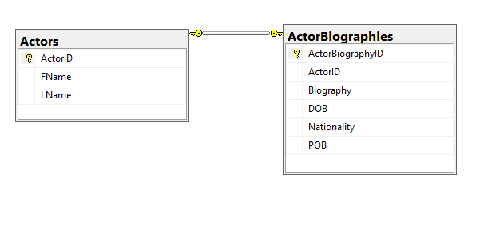
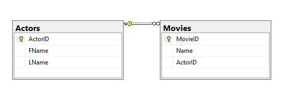

<a href="https://entityframework-extensions.net/">**Improve EF Core performance with EF Extensions**</a>

<a href="https://entityframework-extensions.net/">

</a>

# Relationship in EF-Core

In Entity Framework Core, relationship means how two or more entities related to each other in the database.

* In a database, there can be multiple entities that relate to each other in terms of their entity classes or entity types.
* But if any entity does not have any relation with other entities then the user can use the **foreign key entity** at place of that entity.
* When the user creates a relationship between two entities the primary entity becomes the **principal entity** while the other entity is termed as a **dependent entity**.
* The principal entity is the main entity in the relationship and the dependent entity holds the foreign key that refers to the principal entity’s primary key when the application is initiated.

One of the advantages of having **relational data** is that it stops the multiple entries of similar data, which in turn puts less weight on the database in-turn improving the performance.

**For** **example:** Consider a company keeps all the details of its employees including their home address, contact details and more and due to some reason, the position of that employee is shifted to another department. 

In this case, instead of re-entering all the details, the company could just relate that data as the principal entity of that employee and just modify its position.

In Entity Framework Core, there is various form of relationships such as:

* One-to-One Relationship.
* One-to-Many Relationship.
* Many-to-Many Relationship.
* OnDelete Method.

## One-to-One Relationship

In a one-to-one relationship, the entities in one database table can relate to the entities of another database table. Only one row of entities in a table can relate to another row of the different tables to make it less complicated.

So, the first database table will be termed as the principal entity, and the other table will be represented as the dependent entity.

The updated Entity Framework Core also supports table splitting feature which enables it to use a single database table to showcase one-to-one relationships for both the entities and eliminates the need for having two separate database tables.

To configure a one-to-one relationship the developers can either use the Convention approach or they can even use the Fluent API approach.



This is example of one-to-one relationship; each Actor can have only one biography.

```csharp
public class Actors
{
    public int ActorId { get; set; }
    public string FName { get; set; }
    public string LName { get; set; }
    public ActorBiographies Biography { get; set; }
}

public class ActorBiographies
{
    public int ActorBiographyId { get; set; }
    public string Biography { get; set; }
    public DateTime DOB { get; set; }
    public string POB { get; set; }
    public string Nationality { get; set; }
    public int ActorID { get; set; }
    public Actors Actor { get; set; }
}
```

## One-to-Many Relationship

In the one-to-many relationship, each row of the principal entity table can relate with the multiple rows of the dependent database table.



To establish a one-to-many relationships there are two basic ways:

### Using Convention Approach

```csharp
public class Actor
{
    public int ActorID { get; set; }
    public string FName { get; set; }
    public string LName { get; set; }
    public List<Movie> Movies { get; set; }
}

public class Movie
{
    public int MovieID { get; set; }
    public string Name{ get; set; }
}
```

### Inverse Navigation Property

```csharp
public class Actor
{
    public int ActorID { get; set; }
    public string FName { get; set; }
    public string LName { get; set; }
    public List<Movie> Movies { get; set; }
}

public class Movie
{
    public int MovieID { get; set; }
    public string Name { get; set; }
    public Actor Actor { get; set; }
}
```

### Fully Defined Relationship

```csharp
public class Actor
{
    public int ActorID { get; set; }
    public string FName { get; set; }
    public string LName { get; set; }
    public List<Movie> Movies { get; set; }
}

public class Movie
{
    public int MovieID { get; set; }
    public string Name { get; set; }
    public int ActorID { get; set; }
    public Actor Actor { get; set; }
}
```

#### Optional Relationships

```csharp
public class Actor
{
    public int ActorID { get; set; }
    public string FName { get; set; }
    public string LName { get; set; }
    public List<Movie> Movies { get; set; }
}

public class Movie
{
    public int MovieID { get; set; }
    public string Name { get; set; }
    public int? ActorID { get; set; }
    public Actor Actor { get; set; }
}
```

### Using the Fluent API Approach

### Has/With pattern

```csharp
protected override void OnModelCreating(Modelbuilder modelBuilder)
{
    modelBuilder.Entity<College>()
        .HasMany(c => c.Students)
        .WithOne(e => e.College);
}
protected override void OnModelCreating(Modelbuilder modelBuilder)
{
    modelBuilder.Entity<Students>()
        .HasOne(e => e.College)
        .WithMany(c => c.Students);
}
```

### Required relationship

```csharp
protected override void OnModelCreating(Modelbuilder modelBuilder)
{
    modelBuilder.Entity<College>()
        .HasMany(c => c.Students)
        .WithOne(e => e.College).
        .IsRequired();
}
```

### Cascading Referential Integrity Constraints

```csharp
protected override void OnModelCreating(Modelbuilder modelBuilder)
{
    modelBuilder.Entity<College>()
        .HasMany(c => c.Students)
        .WithOne(e => e.College).
        .OnDelete(DeleteBehavior.SetNull);
}

protected override void OnModelCreating(Modelbuilder modelBuilder)
{
    modelBuilder.Entity<College>()
        .HasMany(c => c.Students)
        .WithOne(e => e.College).
        .OnDelete(DeleteBehavior.Delete);
}
```

## Many-to-Many Relationship

This type of relationship can also be classified as two one-to-many relationships in Entity Framework Core. To make it work the developer must create a joining entity class.

Earlier in Entity Framework, the application uses to create the joining entity automatically, but in the Entity Framework Core, this method must be applied manually.

Unlike the one-to-many relationship, the conventional approach cannot be applied.

Data Annotation approach can be applied and to make it work, the developer must create a join table for the application, but in this, we can’t create a primary key.

So, fluent API seems to be the best option for using a many-to-many relationship in Entity Framework Core.

```csharp
public class Movie
{
    public int MovieId { get; set; }
    public string Name{ get; set; }
    public Actor Actor { get; set; }
    public List<Genre> Genres { get; set; }
}

public class Genre
{
    public int GenreId { get; set; }
    public string GenreName { get; set; }
    public List<Movie> Movies{ get; set; }
}
```

However, for the future upcoming updates like the EF Core, Microsoft is considering to kick off the join table entity feature from many-to-many relationships.

If the join table is removed, it will become easy for the developers to interact with the queries directly, without the need of creating a join table.

They are making the Entity Framework more agile than before.

## OnDelete Method

This method adds the ability to apply delete actions between relational entities and delete the entities which are not being used by the application.

Usually, this method is applied to the end of the above-mentioned relationship methods, so the `OnDelete` method either deletes entities or restricts other commands from deleting the entities.

The `OnDelete` Method can use the following values in the Entity Framework Core:

* Restrict.
* SetNull.
* ClientSetNull.
* Cascade.

